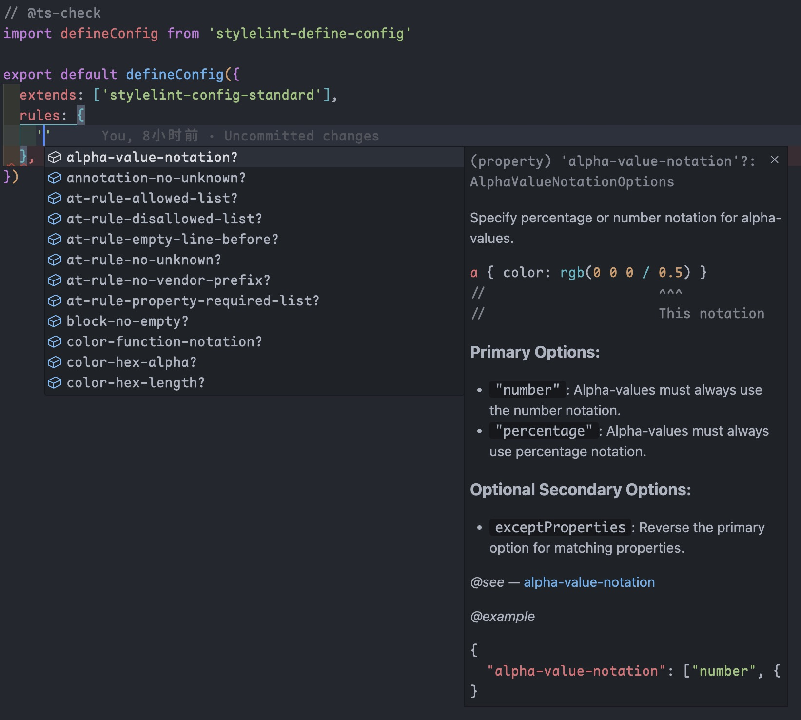
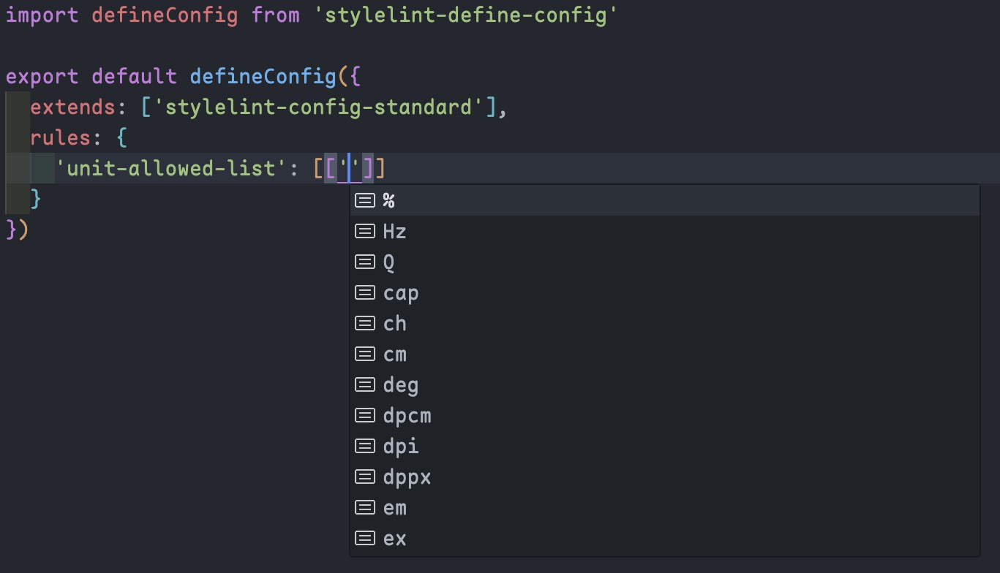

## stylelint-define-config

Provide a `defineConfig` function for `stylelint.config.js`.

## Install

```sh
npm i -D stylelint-define-config
# or
pnpm add -D stylelint-define-config
# or
yarn add -D stylelint-define-config
```

## Usage

By default only stylelint's rules are supported. To activate auto-suggestions for Rules of specific plugins, you need to install the respective types for that plugin.

Plugins can either support their own types, or they could be supported by the community in the [@stylelint-types](https://www.npmjs.com/org/stylelint-types) repository.

`stylelint.config.js`
```js
// @ts-check
const defineConfig = require('stylelint-define-config')

/// <reference types="@stylelint-types/stylelint-scss" />

module.exports = defineConfig({
  extends: 'stylelint-config-standard',
  rules: {
    // ...rules
  }
})
```

## Why?

Improve your eslint configuration experience with:

- auto-suggestions
- type checking (Use `// @ts-check` at the first line in your `stylelint.config.[c,m]js`)
- documentation





## LICENSE

[MIT](LICENSE)
